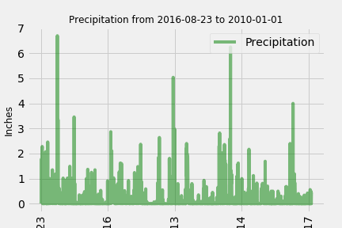
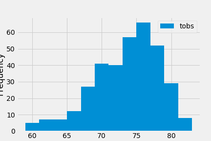

## sqlalchemy-challenge

# Climate Analysis

## Challenge

Holiday! Holiday! Holiday! Surf's Up! As we begin to plan our trip to Honolulu, Hawaii, it's best we complete a climate analysis on the area. There are several parts to get a clear pictures of climate. Review below how we use Python, SQLAlchemy, Pandas, Matplotlib, and JSON.

## Part 1: Climate Analysis and Exploration

To begin, I used Python and SQLAlchemy to do a basic climate analysis and data exploration of the climate database. I was able to create a chart using SQLAlchemy ORM queries, Pandas, and Matplotlib as well. Here we describe both precipitation and station analysis

### Precipitation Analysis

- Imported tools for climate analysis and graphing: Matplotlib, numpy, pandas, datetime, sqlalchemy
- Created engine to interact with database listed on sqlite platform: 
- Reflected the hawaii.sqlite database so a session can be created from the engine. Note: ORM queries are created within the session
- Viewed classes and tables to best understand data
- Performed a query to retrieve date range for one year from the most recent date (08-24-20216 to 08-23-2017) and precipiation
- Created dF using Pandas and plotted data using Matplotlib

### Station Analysis

- Designed query to calcuate total number of stations (9)
- Used above query to find most active stations
    >- Listed stations and count of temperature observations in descending order
    >- Queried to find exact station with highest number of temperature observation
- Designed query to retrieve last 12 monts of temperature observation
    >- Filtered by stations with highest number of oberversations
    >- Graphed histogram using matplotlib with bins=12

## Part 2: Design Your Climate App

I designed a Flask API based on the queries that was developed in the precipitation analysis.

- Used Flask to create routes
    >- Home page
    >- Precipitation
    >- Stations
    >- Temperature Observations
    >- Min, Max, and Avg Temperature with any given start date
    >- Min, Max, and Avg Temperature with any given start/stop date

- Joined station and measurement tables for analysis queries
- Converted query results to a dictionary 
- Returned a JSON list of stations from each dataset (jsonify)

