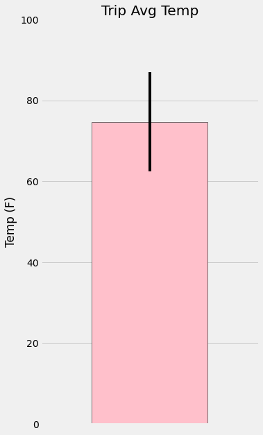
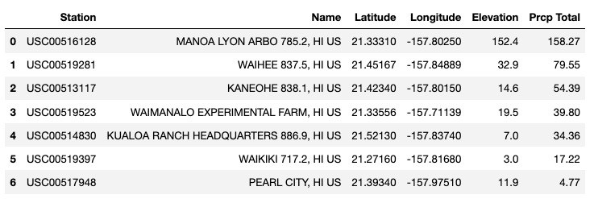
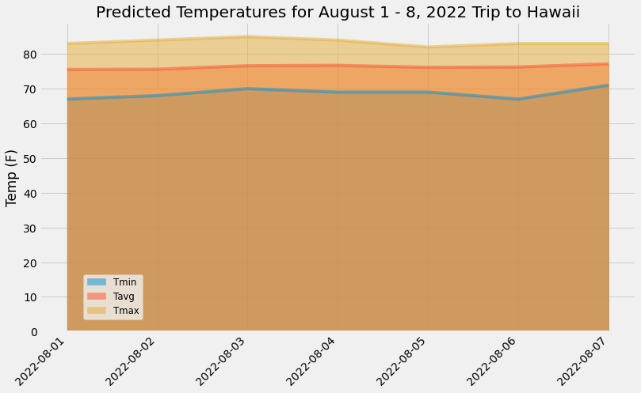

## sqlalchemy-challenge

# Climate Analysis

## Challenge

Holiday! Holiday! Holiday! Surf's Up! As we begin to plan our trip to Honolulu, Hawaii, it's best we complete a climate analysis on the area. There are several parts to get a clear pictures of climate. Review below how we use Python, SQLAlchemy, Pandas, Matplotlib, and JSON.

## Part 1: Climate Analysis and Exploration

To begin, I used Python and SQLAlchemy to do a basic climate analysis and data exploration of the climate database. I was able to create a chart using SQLAlchemy ORM queries, Pandas, and Matplotlib as well. Here we describe both precipitation and station analysis

### Precipitation Analysis

- Imported tools for climate analysis and graphing: Matplotlib, numpy, pandas, datetime, sqlalchemy
- Created engine to interact with database listed on sqlite platform: 
- Reflected the hawaii.sqlite database so a session can be created from the engine. Note: ORM queries are created within the session
- Viewed classes and tables to best understand data
- Performed a query to retrieve date range for one year from the most recent date (08-24-20216 to 08-23-2017) and precipiation
- Created dF using Pandas and plotted data using Matplotlib

### Station Analysis

- Designed query to calcuate total number of stations (9)
- Used above query to find most active stations
    >- Listed stations and count of temperature observations in descending order
    >- Queried to find exact station with highest number of temperature observation
- Designed query to retrieve last 12 monts of temperature observation
    >- Filtered by stations with highest number of oberversations
    >- Graphed histogram using matplotlib with bins=12

## Part 2: Design Your Climate App

I designed a Flask API based on the queries that was developed in the precipitation analysis.

- Used Flask to create routes
    >- Home page
    >- Precipitation
    >- Stations
    >- Temperature Observations
    >- Min, Max, and Avg Temperature with any given start date
    >- Min, Max, and Avg Temperature with any given start/stop date

- Joined station and measurement tables for analysis queries
- Converted query results to a dictionary 
- Returned a JSON list of stations from each dataset (jsonify)

## Bonus Challenge: Temperature Analysis I and II

## Temperature Analysis I

Temperature Analysis I challenged answered the following question: Hawaii is reputed to enjoy mild weather all year round. Is there a **meaningful** difference between the temperature for **June** and **Decemeber**?

Short answer: **Yes!**

## Challenge Process and Analysis
- Used SQLAlchemy to extract the temperature data from June and Decemeber into a DataFrame
- Computed average temperature for June and December
- Conducted a paired t-test due to 2 independent samples from the same population to determine whether the difference in the mean is statistically significant
- The p-value in temperatures compared in June and Decemeber is 3.9. Therefore, a p-value < 5% indicates evidence that you should reject the null hypothesis. 

***The latter concludes that the difference in temperatures between June and Decemeber is significant.***

## Temperature Analysis II

Let's take a look at the historical temperatures during our planned trip dates (August 1-7, 2022). We are worried that the weather would be less ideal. The challenge answers the following: Will the weather be ideal for our trip dates Aug 1-7?

Short answer: **Yes!**

## Challenge Process and Analysis
### Average Temperature Over One Year (Trip Dates)
- Used **calc_temps** function to calculate the minimum, average, and maximum temperatures for year of data matching trip dates in the data (i.e. 08-01-2016 - 08-01-2017)
- Plotted **calc_temps** (minimum, average, and maximum) temperatures from the previous query as a bar chart
    - Used average temp as the bar height (***y*** value)
    - Used the peak-to-peak (TMax-TMin) value as the ***y*** error bar (YERR)

***The minimum, average, and mimimum temperature over the trips one year dates were as followed: **58.0 F, 74.7 F, and 87.0 F**.*** ***(YERR = 29 F difference)***

**74.7 F or higher is the ideal temperature we should aim for our trip.**

## Daily Rainfall Average 
We have the ideal temperature. Now, we sought to review daily rain aveerages per station over a year of data. The latter helped to determine which station we should visit during our trip dates. 

## Challenge Process and Analysis
### Average Rainfall Over One Year (Trip Dates)
- Created **sel_query** to pull back table columns with data across tip dates over one year
- Captured query to add sum precipitation and sorted 
- Created DataFrame for total rainfalls

***The daily average rainfall noted that it's best that we visit **station: USC00517948** with **lowest preciptiation total of 4.77** during our trip dates of August 1-7.***
### Daily Temperature Normals
Let's best understand the temperature during our trip dates (08/01 - 08/07). We calculated the daily normals for the duration of the trip dates (08-01 and 08-07). Normals are the averages for the minimum, average, and maximum temperatures.

## Challenge Process and Analysis
- Set start and end date of the trip
- Used the date to create a range of dates
- Stripped off the year, and save a list of strings in the format %m-%d.
- Used the **daily_normals** function to calculate the normals for each date string, and append the results to a list called "normals"
-Loaded the list of daily normals into a Panda DataFrame, and set the index equal to the date
- Used Pandas to area plot(**staked=False**) for the daily normals, as shown in the following image:
- Closed out engine session

**The trip predicted temperature normals (Min, Avg, and Max) by date were the following:

***The trip dates normals determined that, over the course of the time we would be in Hawaii, **the temperature would be ideal to visit**. The temperature average over our trip dates is near trip average over one year of data.***

